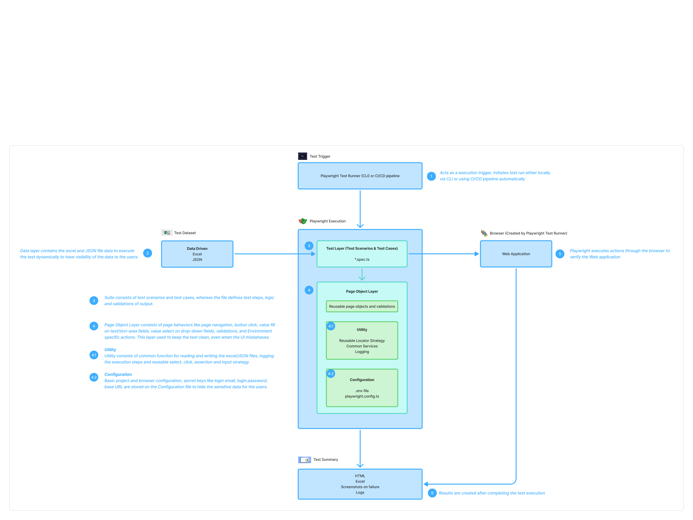

# AUTOMATION FRAMEWORK - PLAYWRIGHT

## OVERVIEW

This automation framework is a custom-built Playwright + TypeScript framework designed for scalable, maintainable, and reusable test automation.

The framework follows a modular architecture with shared components, reusable utilities, dynamic locators, and data-driven testing support.

- It is designed to support:
- Large-scale automation
- Multi-module applications
- Reusable components
- Multi-language testing
- Environment-based execution
- Data-driven testing
- Runtime data handling
- Custom locator strategy
- Centralized configuration

## FRAMEWORK ARCHITECTURE


### Architecture Layers
#### 1. Test Layer
Locations:
```
tests/
```
Responsibilities
- Define test scenarios
- Execute test flows
- Call page objects
- Use test data
- Perform validations

Tests interact with the Page Object Layer and Utilities.

#### 2. Page Object Layer

Structure:
```
page-objects/
    ├── shared-components/
    └── modules-one/
```
##### Shared Components

Reusable UI components are stored in:
> shared components/

**base-page.ts**

BasePage contains reusable automation methods:
- Module locators
- Button locators
- API functions
- Toast verifications
- Field and Button Locator creation

Benefits:

- Standardized actions
- Reduced code duplications
- Easier maintenance

**page-headers.ts**

Reusable header component.

Used for:
- Navigation
- Logout
- Global header actions

##### Module Pages (eg. authentication)
Located under:
> module-one/

Contains module-specific page objects and workflows.

#### 3. Utilities Layer
##### Helpers

Location:
> utils/helpers/

Contains reusable helper modules used across the framework

**common-services**

Provides resuable services:

- Excel handling
- JSON handling
- File operations
- Date conversions

```
const data = await readExcel("example.xlsx");
await writeExcel("");
const data = await readJSON("example.json);
await writeJSON("");
```

**custom-locators.ts**

Centralized locator builder:

- Xpath
- CSS
- Role
- Text
- TestID
- etc...

Supports common operations:

- Fill
- Select
- Type
- Click
- Assertions
- Wait
- Retry mechanism
- Timeout handling
- etc...

Benefits:

- Standard locator strategy
- Easy maintenance
- Flexible locator creation

Example:
```
this.customLocator({
 type: "xpath",
 locator: "//button[text()='Login']"
});
```

**web-elements.ts**

Custom wrapper for playwright locators:

- Centralized locator usage
- Element description

Benefits:

- Cleaner code
- Better debugging
- Improved stability

Example:
> new WebElements(locator,"Login Button");

**env-configuration.ts**

Handles environment configuration.

Supports multiple environments:

- Dev
- QA
- UAT
- Production

Uses:

> .env

Example:

```
BASE_URL=
USERNAME=
PASSWORD=
```

**test-config.ts**

Stores framework-level configurations:

- Execution settings
- URL Configuration

**step-loggers.ts**

Custom execution logger.

Logs:
- Execution steps
- Actions performed
- Failure

Example:

```
[2026-02-19T16:05:04] [Info] - 
[2026-02-19T16:05:04] [Info] - ==================== Starting execution for the test case "TC_001 | POSITIVE | Description" ====================
[2026-02-19T16:05:04] [Info] - 
[2026-02-19T16:05:06] [Info] - Action: Navigated to the: ""
[2026-02-19T16:05:08] [Info] - Action: Scrolled to the "" button
[2026-02-19T16:05:09] [Info] - Action: Clicked the "" button
[2026-02-19T16:05:09] [Info] - Action: Scrolled to the "" field
[2026-02-19T16:05:09] [ERROR] - ACTION: Entered "" in the "" field
```

Benefits:

- Easy debugging
- Clear execution area

##### Constants

Location:
> utils/constants/

Used for language-based testing.

Structure:
```
constants/
 ├── er/
 │   └── language.json
 └── fr/
     └── language.json
```
Supports:
- Localization testing
- UI text validation
- Muli-language automation

#### 4. Test Data Layer

Location:
> test-data/

Supports **Data Driven testing**

##### Input Data

Location:
> test-data/input-data/

Contains static test data:
```
example.xlsx
example.json
```

Used for:
- Form data
- Bulk testing

##### Runtime Data

Location:
> test-data/run-time/

Stores dynamically generated data during test execution.

Examples:

```
Login.json
Logout.json
```

Used for:
- Session values
- IDs
- Tokens
- Test chaining

## FOLDER STRUCTURE
```
.
└── framework/
    ├── node-modules/
    ├── page-objects/
    │   ├── shared-components/
    │   │   ├── base-page.ts
    │   │   └── page-header.ts
    │   └── modules-one/
    ├── test-data/
    │   ├── input-data/
    │   │   ├── example.xlsx
    │   │   └── example.json
    │   └── run-time/
    │       ├── login.json
    │       └── logout.json
    ├── tests/
    ├── utils/
    │   ├── constants/
    │   │   ├── er/
    │   │   │   └── language.json
    │   │   └── fr/
    │   │       └── language.json
    │   └── helpers/
    │       ├── common-service.ts
    │       ├── custom-locator.ts
    │       ├── env-configuration.ts
    │       ├── step-logger.ts
    │       ├── test-config.ts
    │       └── web-elements.ts
    ├── playwright.config.ts
    ├── tsconfig.json
    ├── package.json
    ├── .gitignore
    ├── .env
    └── .env.sample
```

## EXECUTION FLOW

```
Test File
   ↓
Page Object
   ↓
Base Page
   ↓
WebElements
   ↓
Custom Locator
   ↓
Playwright
   ↓
Browser
```

## DESIGN PATTERN
### Page Object Model (POM)

The framework uses the **Page Object Model (POM)** design pattern to separate:

- Test Logic
- Test Locators
- Page Actions

#### Benefits
- Better code reusability
- Easier maintenance
- Cleaner test cases

#### Example

```
export class LoginPage extends BasePage {

  username = this.createInputField("Email");
  password = this.createInputField("Password");
  loginButton = this.createButton("Login");

  async login(user: string, pass: string) {
    await this.enterText(this.username, user);
    await this.enterText(this.password, pass);
    await this.click(this.loginButton);
  }
}
```

## INSTALLATION

### INSTALL NODE MODULES
> pnpm install

### INSTALL PLAYWRIGHT BROWSER
> pnpm exec playwright install

### EXECUTE TEST

#### To execute test in headed mode
> pnpm {script-command}
#### To execute test in headed mode
> pnpm {script-command} --headed

**Note:** {script-command} is stored under **scripts:** key in the **package.json** file

### OPEN REPORT
> pnpm exec playwright show-report

### COPY .ENV FROM .ENV.EXAMPLE
> cp .env.example .env

## FRAMEWORK FEATURES

✔ Modular Architecture <br>
✔ Page Object Model <br>
✔ Custom Locator Strategy <br>
✔ Reusable Components <br>
✔ Data Driven Testing <br>
✔ Runtime Data Handling <br>
✔ Multi-Language Support <br>
✔ Environment Configuration <br>
✔ Custom Logging <br>
✔ Parallel Execution Support <br>

## FRAMEWORK ADVANTANGES

### Scalable

Supports enterprise-level application.

### Maintainable

Centalized logic simplifies updates.

### Reusable

Shared components reduce duplication.

### Flexible

Supports multiple environments and data sources.

### Reliable

Retry and timeout handling improves stability.